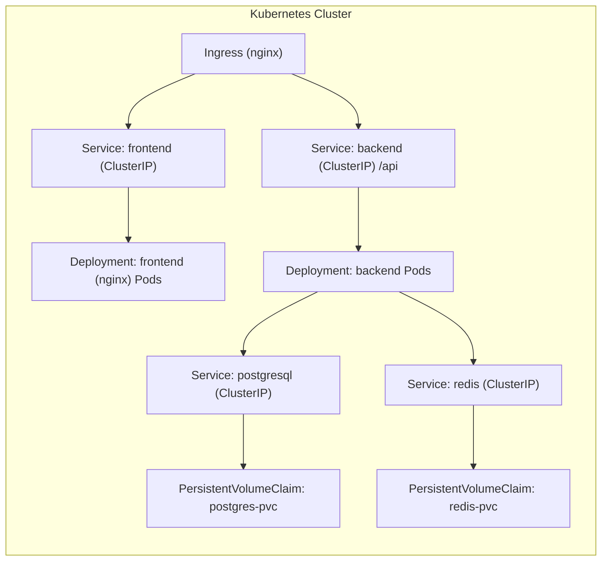

# Kubernetes Architecture for BMI Health Tracker

## Diagram (Mermaid)


## Summary
This architecture places the frontend behind an Ingress controller which serves the static site and forwards API requests under `/api` to the backend service. The backend connects to PostgreSQL for persistent storage and Redis for ephemeral caching/session storage. Both Postgres and Redis have PersistentVolumeClaims backing their data.

## Resource allocation
- Frontend pods: small footprint, requests: `cpu: 100m`, `memory: 128Mi`; limits: `cpu: 250m`, `memory: 256Mi`.
- Backend pods: moderate, requests: `cpu: 250m`, `memory: 256Mi`; limits: `cpu: 500m`, `memory: 512Mi`.
- Postgres: single replica with `5Gi` PVC (adjust based on dataset).
- Redis: single replica with `1Gi` PVC (if persistence required; otherwise omit PVC for in-memory only).

## Scaling strategies
- Frontend: scale horizontally (increase replicas) behind the Ingress; typically 2+ replicas.
- Backend: scale replicas and use a load balancer via Service + Ingress; ensure the database can handle pooled connections — use connection pooling and set `maxConnections` accordingly.
- Database: scale vertically (bigger instance) or move to managed DB for high availability. For HA in-cluster, use StatefulSets and a proper backup/replication strategy.

## Detailed manifest explanations

- `namespace.yaml` — creates `bmi-health` namespace to isolate resources.
- `postgres-secret.yaml` — stores `POSTGRES_USER`, `POSTGRES_PASSWORD`, and `POSTGRES_DB`. Replace `change_me` with a secure value or use an external secrets manager.
- `postgresql-deployment.yaml` — Deployment (1 replica), ClusterIP Service, and a PVC `postgres-pvc` for persistent storage. For production consider a StatefulSet or managed DB.
- `redis-deployment.yaml` — Deployment, Service, and `redis-pvc` for persistence. For robust setups, consider a Redis operator or managed Redis.
- `backend-deployment.yaml` — Deployment and Service for backend. Uses `DATABASE_URL` env var pointing to the `postgresql` service. Includes liveness/readiness probes, and resource requests/limits.
- `frontend-deployment.yaml` — Deployment and Service for frontend static site (nginx). Served via Ingress.
- `ingress.yaml` — Ingress rule to route traffic for `example.com` to the frontend and `/api` to backend. Replace `example.com` with your domain and enable TLS (add `tls:` section and certificate via cert-manager or Ingress controller).

## How to apply
1. Install an Ingress controller in your cluster (e.g., `nginx-ingress` or `ingress-nginx`).
2. From project root:

```bash
kubectl apply -f kubernetes/namespace.yaml
kubectl apply -f kubernetes/postgres-secret.yaml
kubectl apply -f kubernetes/postgresql-deployment.yaml
kubectl apply -f kubernetes/redis-deployment.yaml
kubectl apply -f kubernetes/backend-deployment.yaml
kubectl apply -f kubernetes/frontend-deployment.yaml
kubectl apply -f kubernetes/ingress.yaml
```

3. Verify pods and services:

```bash
kubectl get pods -n bmi-health
kubectl get svc -n bmi-health
kubectl describe ingress -n bmi-health
```

## Notes & production considerations
- Replace `your-registry/...` images in manifests with your image repository (GHCR, Docker Hub, etc.).
- Use `Secrets` or an external secrets manager for credentials; consider `sealed-secrets` or cloud provider secret stores.
- Use StatefulSets for Postgres and Redis for stable network identities and stable storage.
- Add PodDisruptionBudgets, resource limits, and HPA (HorizontalPodAutoscaler) for the backend.
- Use readiness probes to prevent traffic routing to pods that are not ready.
- Configure backups for Postgres (cronjobs to dump or managed backups).

If you want, I can:
- Convert Postgres and Redis to `StatefulSet` manifests with headless services.
- Add `HorizontalPodAutoscaler` for the backend and frontend.
- Add TLS + cert-manager example for Ingress.
